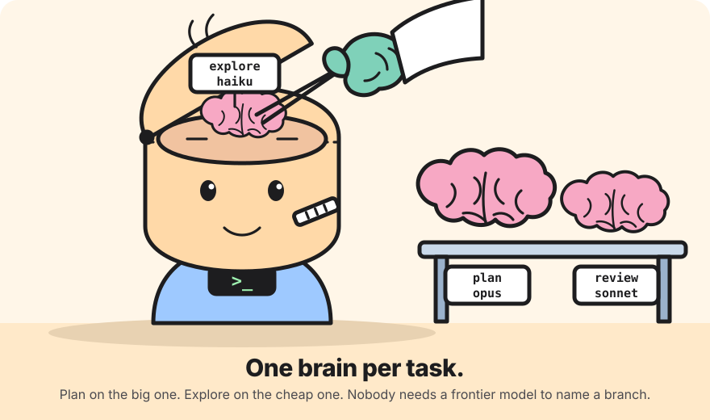

<p align="center">
  
</p>

# Lobotomy: one brain per task

Lobotomy lets you assign a different model (and thinking effort) to each kind
of work your coding agent does, instead of running everything on one model.
Plan on the strongest model, explore and answer quick questions on the
cheapest, review on something in between, and compact context without paying
frontier prices for a summary.

It ships as two plugins that share one task vocabulary and one way of
configuring it: a keyboard-driven config screen, plus a one-line command for
scripting.

| Host | Folder | Install |
| --- | --- | --- |
| [Claude Code](https://code.claude.com) | `claude-code/` | `claude plugin marketplace add /path/to/lobotomy` then `claude plugin install lobotomy@lobotomy`, or `claude --plugin-dir /path/to/lobotomy/claude-code` |
| [pi](https://pi.dev) | `pi/` | `pi install /path/to/lobotomy/pi` (or `pi -e /path/to/lobotomy/pi/extensions/lobotomy/index.ts` to try it) |
| [OpenCode](https://opencode.ai) | `opencode/` | link `opencode/lobotomy.ts` into `~/.config/opencode/plugins/` |
| Goose, Aider, Continue CLI, Crush | `cli/` | `cd cli && npm install && npm link`, then `lobotomy` |

Claude Code and pi route inside the session and have their own `/lobotomy`
screen. OpenCode has a plugin that reads the shared routes file. The rest
only read config files, so the `lobotomy` CLI writes those files from one
shared routes file with a picker of its own.

## The tasks

A task is a kind of work the agent does. Each one has a route: a model, an
optional effort or thinking level, or `inherit` to leave the session's own
choice alone. Nothing is routed until you say so.

| Task | What it covers | Claude Code | pi |
| --- | --- | --- | --- |
| `main` | the main conversation | every request of the main loop | the session model between tasks |
| `plan` | planning before changing code | plan mode (`shift+tab`), and the `Plan` agent | `/plan` toggles read-only planning mode |
| `quick` | one-off cheap questions | `/quick <question>` | `/quick <question>` |
| `review` | code review | `/code-review`, `/security-review`, `/simplify` | `/review [focus]` |
| `commit` | commit messages and PR text | the commit and PR skills | `/commit [hint]` |
| `compact` | context compaction summaries | `session.compact` (experimental) | compaction and `/tree` branch summaries |
| `explore` | codebase search | the `Explore` agent | — |
| `subagent` | every other delegated agent | any other `Agent` spawn | — |
| `background` | agents run in the background | `run_in_background` spawns | — |
| `helper` | plugins' own small model calls | `$.model.complete` / `classify` | — |

Claude Code also takes two kinds of override, more specific than a task:

- `agent:<type>` routes one agent type, e.g. `agent:claude-code-guide`.
- `skill:<name>` routes the rest of any turn in which that skill expands,
  e.g. `skill:init`.

pi has no built-in subagents, so the agent tasks don't apply there. If you use
pi's `subagent` example extension, set `model:` in each agent's frontmatter.

The config-file agents honour these tasks (verified against each tool's
current source in October 2026):

| Agent | Tasks | What is written |
| --- | --- | --- |
| OpenCode | main, plan, quick, review, commit, compact, subagent, explore | `agent.<build/plan/general/explore/title/summary/compaction>.model`, `small_model`, `/quick` `/review` `/commit` commands |
| Goose | main, subagent | `active_provider` + `providers.<id>.model`, `GOOSE_SUBAGENT_PROVIDER/MODEL` (Goose removed its planner and lead/worker modes) |
| Aider | main, edit, commit, compact | `model`, `editor-model`, `weak-model` (commit wins over compact), `reasoning-effort` |
| Continue CLI | main, edit, subagent | the first `chat`-role model, `edit`/`apply` roles, a `subagent`-role model |
| Crush | main, compact | `models.large`, `models.small` (titles), `reasoning_effort` |

There is also an `edit` task for agents that apply edits with a separate model
(Aider's editor model, Continue's edit and apply roles).

## Configuring

### The screen

`/lobotomy` opens the config screen in either host.

- **Claude Code** opens a pane. Tab moves between fields, Enter opens a
  picker, Esc closes. Each task has a model picker (`inherit`, `haiku`,
  `sonnet`, `opus`, `fable`, or `custom…` for a full model id) and an effort
  picker (`default`, `low`, `medium`, `high`, `xhigh`, `max`). Agent types the
  session has offered appear as override rows. `r` resets, `q` closes.
- **pi** opens a settings list. Enter on a task opens a two-step picker: a
  model (every model you have credentials for; type to filter), then a thinking
  level. A `Save to` row chooses between the global file and the project file.

### One line

```
/lobotomy set plan opus high          # Claude Code: alias or full id, then effort
/lobotomy set quick anthropic/claude-haiku-4-5 low   # pi: provider/model, then thinking
/lobotomy set agent:Explore haiku     # Claude Code override
/lobotomy clear plan
/lobotomy status
/lobotomy reset
```

### The CLI

```
lobotomy                                   # picker: tasks, per-agent overrides, apply
lobotomy set plan anthropic/claude-opus-5-5 high
lobotomy set aider:commit anthropic/claude-haiku-4-5   # one agent only
lobotomy status                            # the routes, and what each agent gets
lobotomy apply                             # write every agent's config file
lobotomy apply aider crush --project       # project-level files where the agent has them
lobotomy apply --dry-run
```

Models are `provider/model-id`. Each adapter respells the provider where the
agent differs (`google/…` becomes `gemini/…` for Aider, Continue and Crush) and
says in its notes when something cannot be honoured. Existing config is merged
and YAML comments are kept. Routes live in `~/.config/lobotomy/lobotomy.json`
(or `$LOBOTOMY_CONFIG`); the OpenCode plugin reads the same file.

### Where it lives

- Claude Code keeps the routes in the plugin's own store (per user, across
  sessions). `/lobotomy status` prints them.
- pi reads `~/.pi/agent/lobotomy.json` and, in a trusted project,
  `.pi/lobotomy.json` on top of it:

```json
{
  "tasks": {
    "main":    { "model": "anthropic/claude-opus-4-8", "level": "medium" },
    "plan":    { "model": "anthropic/claude-opus-4-8", "level": "high" },
    "quick":   { "model": "anthropic/claude-haiku-4-5", "level": "off" },
    "compact": { "model": "anthropic/claude-haiku-4-5" }
  }
}
```

## How routing works

### Claude Code

The plugin is a [function-hooks module](https://code.claude.com/docs/en/plugins/mods/overview.md)
and runs inside the session:

- `turn.step` rewrites the model and effort of each main-loop request. The task
  is the turn's assigned task (`/quick`, a review or commit skill), else `plan`
  in plan mode, else `main`.
- `agent.spawn` sets the model of each subagent: `agent:<type>` override, then
  `background`, `explore`, `plan`, then `subagent`. Forks always inherit.
- `model.complete` routes plugins' helper calls to `helper`.
- `session.compact` is answered with a summary written by the `compact` model
  (experimental: it replaces the engine's own summarizer; turn it off by
  clearing the route).

Aliases (`haiku`, `sonnet`, `opus`, `fable`, with an optional `[1m]`) are
turned into full model ids before a main-loop request is rewritten, because
the engine refuses an alias there. The ids come from the
`ANTHROPIC_DEFAULT_<ALIAS>_MODEL` environment variables when set, else from a
built-in table (`claude-haiku-4-5`, `claude-sonnet-5-5`, `claude-opus-5-5`,
`claude-fable-5-1`); use a full id if that table falls behind.

A routed turn shows `🧠 task → model` in the status line. Switching models
mid-turn forfeits the prompt cache for that turn, so route whole tasks rather
than flipping back and forth.

Settings hooks (`hooks.json` command hooks) can't change models, which is why
this is a hooks module rather than a classic plugin. It needs Claude Code 2.1.289
or newer.

### pi

Two paths, chosen at load:

- **pi 1.0 and newer** expose `pi.registerVirtualModel`. Lobotomy registers a
  virtual model `lobotomy/auto`; select it (`/model lobotomy/auto` or
  `pi --model lobotomy/auto`) and every request, compaction included, is routed
  per task without recording model switches in the session. Tool follow-ups
  stay on the model that started the task, so the prompt cache holds.
- **Any pi** (the extension was built against 0.81): the extension calls
  `pi.setModel` and `pi.setThinkingLevel` before a task and restores your own
  choice when the agent settles. `/model` picks made by hand become the model
  tasks come back to.

Compaction and branch summaries use pi's own summarizers with the `compact`
model, so the summary format is unchanged.

### OpenCode

The plugin's `config` hook maps the shared routes onto OpenCode's agents and
commands when OpenCode starts, and its `chat.message` hook sets the model of
every build or plan message as it arrives, so `main` and `plan` changes apply
on the next message. Its `lobotomy` tool lets you change routes from chat.
Verified with `opencode debug config` and `opencode debug agent plan` on
OpenCode 1.18.

## What has been verified live

- Claude Code: a `claude -p --model sonnet` session with `main` routed to
  `haiku` billed only `claude-haiku-4-5` (the JSON result's `modelUsage`), and
  `/lobotomy set`, `status` and `clear` persisted across separate runs.
- pi: a json-mode run with `main` routed to Haiku sent its request to
  `claude-haiku-4-5` (the switch path; the virtual-model path needs pi 1.0).
- OpenCode: `debug config` and `debug agent plan` show the routed agents,
  commands and tool after the plugin loads.
- Goose, Aider, Continue and Crush: the written files were inspected and
  match each tool's current source; the tools themselves were not run.

## Development

```
claude plugin validate claude-code && claude plugin test claude-code   # 12 tests
cd pi && node --test extensions/lobotomy/routing.test.ts               # 6 tests
cd cli && npm install && npm test                                      # 11 tests
```

The pure routing logic lives in `routing.ts` in each plugin and has no host
dependencies. For hot reloading the Claude Code plugin while editing, run
`claude --plugin-dir ./claude-code`.
